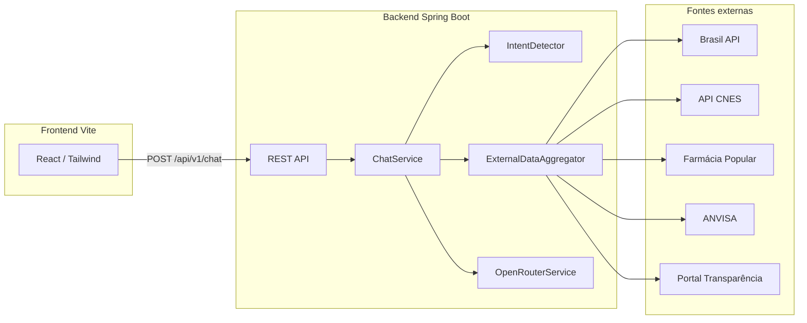

# Guia Cidadão IA

Aplicação web do **Guia Cidadão IA** — assistente orientado a serviços públicos do Distrito Federal (GDF), desenvolvida no contexto do **Hackathon Brasília Virtual 2026**. O repositório reúne um **frontend** (React + Vite) e um **backend** (Spring Boot) que orquestra um modelo de linguagem (OpenRouter) e APIs governamentais/abertas.

## Visão geral da arquitetura



Em **desenvolvimento**, o Vite faz **proxy** de `/api` para `http://localhost:8080`, evitando problemas de CORS ao usar `npm run dev`.

---

## Pré-requisitos

| Camada    | Requisito                          |
|-----------|-------------------------------------|
| Backend   | **Java 21**, **Maven 3.9+**         |
| Frontend  | **Node.js 20+** (recomendado LTS) e **npm** |

---

## Como rodar o backend

```bash
cd backend
```

### Variáveis de ambiente (recomendado)

| Variável | Obrigatória | Descrição |
|----------|-------------|-----------|
| `OPENROUTER_API_KEY` | **Sim**, para o chat com IA funcionar | Chave da [OpenRouter](https://openrouter.ai/) |
| `PORTAL_TRANSPARENCIA_API_KEY` | Não | Usada na consulta de Bolsa Família por NIS (dados abertos) |
| `CORS_ALLOWED_ORIGINS` | Não | Padrão: `http://localhost:5173`. Vários valores separados por vírgula |

Sem `OPENROUTER_API_KEY`, o endpoint de chat responde com uma **resposta de fallback** (orientação genérica, ex.: Central 156).

### Subir a API

```bash
export OPENROUTER_API_KEY="sua-chave-aqui"
mvn spring-boot:run
```

- **API base:** `http://localhost:8080`
- **Health:** `GET http://localhost:8080/api/v1/health`
- **Console H2 (dev):** `http://localhost:8080/h2-console` (JDBC: `jdbc:h2:mem:guiacidadao`, usuário `sa`, senha vazia)

### Testes automatizados (backend)

```bash
cd backend
mvn test
```

### Build JAR

```bash
cd backend
mvn -q -DskipTests package
java -jar target/guia-cidadao-1.0.0.jar
```

---

## Como rodar o frontend

Na **raiz** do repositório (onde está o `package.json` do Vite):

```bash
npm install
npm run dev
```

- **URL padrão:** `http://localhost:5173`
- O proxy em `vite.config.ts` encaminha `/api` para o backend na porta **8080**. Mantenha o Spring Boot ativo para o chat funcionar.

### Build de produção

```bash
npm run build
npm run preview
```

Para produção com frontend e backend em origens diferentes, configure `CORS_ALLOWED_ORIGINS` no backend com a URL do site estático.

---

## API REST (backend)

Prefixo comum: `/api/v1`.

| Método | Caminho | Descrição |
|--------|---------|-----------|
| `POST` | `/chat` | Corpo: `{ "message": string, "sessionId": string }`. Retorna JSON estruturado da resposta da IA (tag, intro, blocos, passos, dicas, contato, locais, relacionadas, meta). |
| `POST` | `/chat/feedback` | Corpo: `{ responseId, sessionId, vote }`. Persistido em H2. **Status atual:** as respostas estruturadas da IA já enviam votos para este endpoint; a mensagem padrão de fallback ainda usa apenas estado local na interface. |
| `GET` | `/health` | Status da aplicação e timestamp. |
| `GET` | `/services/featured` | JSON de serviços em destaque (`classpath:data/featured-services.json`). |
| `GET` | `/services/status` | JSON de cards de status (`data/status-cards.json`). |
| `GET` | `/services/suggestions` | Sugestões de busca (`data/suggestions.json`). |
| `GET` | `/faq` | FAQ (`data/faq.json`). |

O **frontend atual** carrega serviços em destaque, status, FAQ e sugestões a partir de **`src/data/services.ts`** (dados estáticos). Os endpoints acima existem para integração futura ou outros clientes.

---

## Fluxo do assistente (backend)

1. **Detecção de intenção** (`IntentDetector`): categoriza o texto (saúde, trabalho, previdência, trânsito, documentos, assistência social, transparência, Bolsa Família, geral) e extrai **CEP**, **CNPJ**, **placa**, **NIS** quando presentes.
2. **Agregação de dados** (`ExternalDataAggregator`): em paralelo, quando aplicável:
   - **CEP / CNPJ** → [Brasil API](https://brasilapi.com.br/)
   - **Saúde** → estabelecimentos CNES (UBS/UPA), farmácias abertas; contexto pode incluir ANVISA para medicamentos
   - **Bolsa Família + NIS** → API do Portal da Transparência (com chave opcional)
3. **Contexto para o modelo** (`ContextBuilder` + `ai-context.md`): monta o prompt de sistema com os dados coletidos.
4. **LLM** (`OpenRouterService`): chama a API de chat completions (modelo configurável em `application.properties`, padrão Gemma via OpenRouter).
5. **Resposta** (`ResponseParser`): valida e mapeia o JSON retornado pelo modelo para o contrato `ChatResponse`.
6. **Log** (`ChatLog`): mensagens processadas ficam registradas em H2 (memória).

Falhas em APIs externas são tratadas com **degradação graciosa** (timeout por fonte, logs de aviso).

---

## Funcionalidades do frontend

| Área | Descrição |
|------|-----------|
| **AlertBar / IdentityBar / Nav** | Cabeçalho institucional e navegação visual do portal. |
| **Hero** | Campo principal de pergunta; ao enviar, inicia o modo “conversa”. |
| **Serviços em destaque** | Cards (saúde, DETRAN, RG, INSS, Bolsa Família, trabalho) que disparam perguntas prontas no chat. |
| **Painel de status** | Cards ilustrativos (filas UPA, água, ar, obras) — conteúdo de demonstração em `services.ts`. |
| **FAQ** | Perguntas frequentes clicáveis que enviam consultas ao assistente. |
| **Chat** | Histórico de mensagens usuário/IA, indicador de digitação, barra inferior para novas mensagens. |
| **Resposta da IA** | Tag por tema, introdução em HTML, blocos informativos, passo a passo numerado, dica, card de contato presencial, CTA para serviço oficial, **mapa Leaflet** quando há `locations`, perguntas relacionadas que reenviam ao chat e feedback "ajudou / não funcionou". |
| **Rodapé** | Exibido apenas antes de iniciar o chat. |

**Sessão:** o `sessionId` é um UUID guardado em `sessionStorage` (`guia-cidadao-session`) e enviado em cada mensagem para correlacionar logs e feedback no backend.

---

## Stack técnica

**Frontend:** React 19, TypeScript, Vite 6, Tailwind CSS 3, Leaflet / react-leaflet, Lucide React.

**Backend:** Spring Boot 3.4, Spring Web + WebFlux, Spring Data JPA, H2, Bean Validation, integração HTTP reativa com APIs externas.

---

## Estrutura de pastas (resumo)

```
Hackman/
├── package.json          # Scripts e deps do frontend
├── vite.config.ts        # Dev server + proxy /api → :8080
├── src/                  # App React
│   ├── App.tsx
│   ├── components/
│   └── data/
└── backend/
    ├── pom.xml
    └── src/main/java/br/gov/df/guiacidadao/
```

---

## Licença e contexto

Projeto de hackathon; verifique com a equipe organizadora do evento e o órgão público parceiro sobre uso, marca e dados antes de qualquer deploy público.
